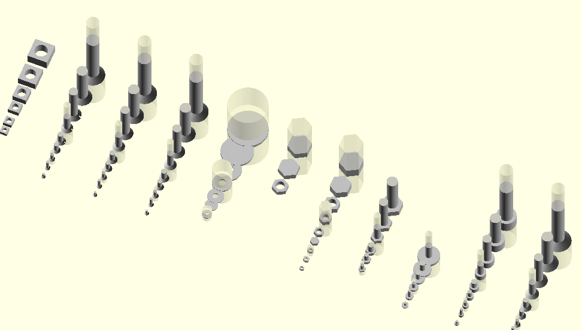

# tams_openscad

OpenSCAD models and libraries used with our robots.

This package collects 3D-models of robot parts, sensors, and
mechanical components to be used with the OpenSCAD 3D-modelling tool.
Feel free to use and modify as needed for your own robots and tools.

In particular, this package includes a set of common "TAMS flange"
adapter plates that we use to quickly assemble combinations of sensors 
and grippers or specialized tools for experiments. 
The basic idea is to combine a <em>core</em> part permanently 
installed on a robot (or fixed assembly) with different <em>outer</em>
adapter plates for different grippers or experiment setups.

We currently use a common size of d=80mm and h=12mm for the core adapters,
which fits the ISO-9409-1-50-4-M6 adapter used on most current cobots
(UR5/UR5e, UR10/UR10e, Kuka LWR4+ iiwa, ...) and the slightly larger
ISO-9409-1-63-4-M6 flange on our Mitsubishi PA10-6C robots.
The outer adapters typically use d=99mm and varying height, depending
on expected payload and tool mounting requirements.

Outer and inner parts are connected with a set of eight radial M4 screws,
so that parts can be mounted or unmounted without disassembly of other
stages or the total robot setup.

There is nothing magical about the values, but they seemed like a promising
combination of required strength/payload and overall size.
To save overall length of the stacked adapters, parts include cavities
to fit the screws/bolts/nuts of the next level.

## Components Overview

This package includes the following <em>core</em> (robot-side) parts:

- UR5/UR5e, UR10/UR10e, LWR4+, iiwa, ... (ISO-9409-1-50-4-M6) flange adapter,
  in three variants: with embedded M4 square nuts, embedded M4 hex nuts,
  or without embedded nuts. The version without embedded nuts is easiest
  to use, but be careful not to over-torque the radial mounting screws.
- Mitsubishi PA10-6C (ISO-9409-1-63-4-M6) flange adapter.
- 3D-printed ISO-9409-1-50-4-M6 compatible adapter (to stack things).

Force/Torque-sensor (tool-side) <em>core</em> adapters:

- ATi Mini45e.
- Robotiq FTS-150 (soon).
- Sunrise Instruments M3207.

And the corresponding <em>outer</em> adapters for the following tools:

- ATi Nano17e force/torque sensor.
- ATi Mini45e force/torque sensor.
- Robotiq FTS-150 force/torque sensor (soon).
- Sunrise Instruments M3207 force/torque sensor.
- passive weight holder for force/torque sensor calibration.

- Robotiq 3-finger adaptive gripper (aka 3-finger hand).
- Schunk WSG-50 parallel gripper.
- TAMS in-house SCSERVO 4-DOF two-finger gripper.
- TAMS in-house tactile arrays.

- DIGIT tactile sensor.
- generic camera-holder (1/4-inch-20-UNC-thread) (6.35 outer, 5.2mm inner, thread 1.27mm).
- fischertechnik-compatible adapter plate.
- ...

## Libraries

The package also collects a set of OpenSCAD part libraries that
you might find useful for your own designs:

- <a href="libs/electronics.scad"><tt>electronics.scad</tt></a>,
  a random collection of basic electronic components and common
  Arduino-boards and sensor breakout boards,
- <a href="libs/simple-screws.scad"><tt>simple-screws.scad</tt></a>,
  simplified models of various DIN/ISO-sized screws, nuts, and washers,
- <a href="libs/load_cells.scad"></tt>load_cells.scad</tt></a>,
  geometric models of common load-cells.

## Disclaimer 

In our lab, these plates are used for different short-time experiments,
typically 3D-printed from common PLA/PETG filament with medium infill values. 
However, the parts are clearly not designed for heavy-duty 24/7 industrial use,
and none of the parts have been checked with FEM analysis for mechanical
stress; all dimensions provided just seemed like an acceptable compromise 
for our use cases and relatively low payloads.
In particular, be careful with overloading the parts, as 3D-printed objects
are always prone to delamination and sudden complete breakage.

## Installation

Just download the package. You will need OpenSCAD to open and
modify the provided 3D-models. 
Of course, you will need a 3D-printer to actually produce the adapter plates,
and the usual components (e.g. M3/M4/M6 screws and nuts) to assemble
the different parts.

<!-- preview: grip README.md + firefox localhost:6419 -->
